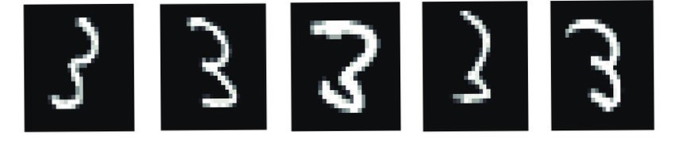

# An information theoretical approach to machine learning

If presented with any of the below images

<figure>

</figure>

most humans would be able to confidently classify any one of them as a
three. And that even though the individual grayscale values of each
pixel differ greatly. Even though the individual wavelengths that the
light-sensitive cells in our eyes perceive are very different from one
three to the next, our visual cortex is able to process all these
different sets of values and confidently predict that they came from a
three. This seemingly trivial task gets exponentially more difficult
when one is told to make a computer program that takes in those
grayscale values as input and should output a single digit corresponding
to the image.

This implementation of a neural network from scratch tackles exactly this problem by using machine learning's first principles.
